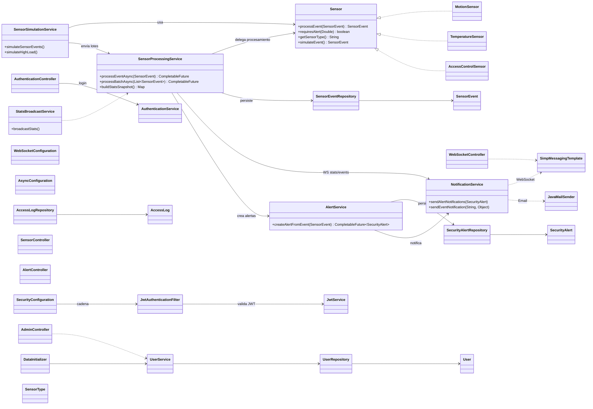

# Arquitectura de Clases — Sistema de Seguridad Concurrente

Notas:
- Las flechas sólidas indican dependencias en tiempo de ejecución (inyección/uso directo). Las punteadas señalan dependencias de infraestructura (mensajería/correo).

